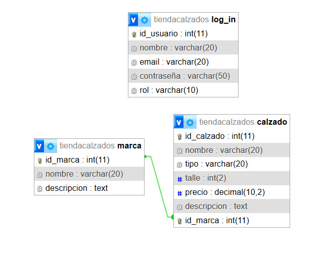

# TPE-WEB-II

**Integrantes del grupo**:
- Almirón, Ana Clara (anialmrn@gmail.com)
- Ianantuoni Buono, Andrea Belén (ianantuoni98@gmail.com)

**Temática**:
El proyecto consiste en el diseño de un modelo de datos para una tienda de calzados.

**Descripción**: Se establecieron las siguientes entidades para el modelo de datos: `marca` y `calzado`. La relación entre ellas es de uno a muchos, donde cada `marca` puede tener múltiples `calzados`, pero cada `calzado` solo puede pertenecer a una `marca`. La tienda clasifica sus productos según la marca a la que pertenecen.

Además, creamos una tabla para `usuario`, que puede ser de dos tipos: administrador o invitado. Dependiendo del tipo de usuario, se otorgan diferentes niveles de acceso: el administrador puede realizar operaciones CRUD (Crear, Leer, Actualizar, Eliminar), mientras que el invitado solo puede ver el catálogo de la tienda.

### Diagrama Entidad-Relación (DER)

